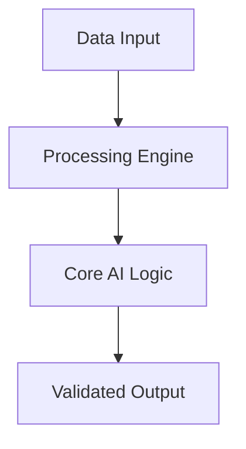

# 🚀 Llm Performance Benchmarker

Standardized benchmarking suite for evaluating Large Language Model latency, throughput, and accuracy.

## 🏗️ Architecture

## 🌟 Features
- High-performance algorithms
- Modular & Scalable design
- Automated MLOps integration

Developed by **Marcos Garcia** (Lead AI Engineer).